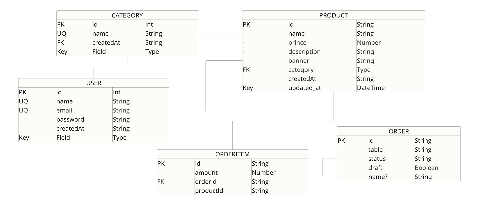
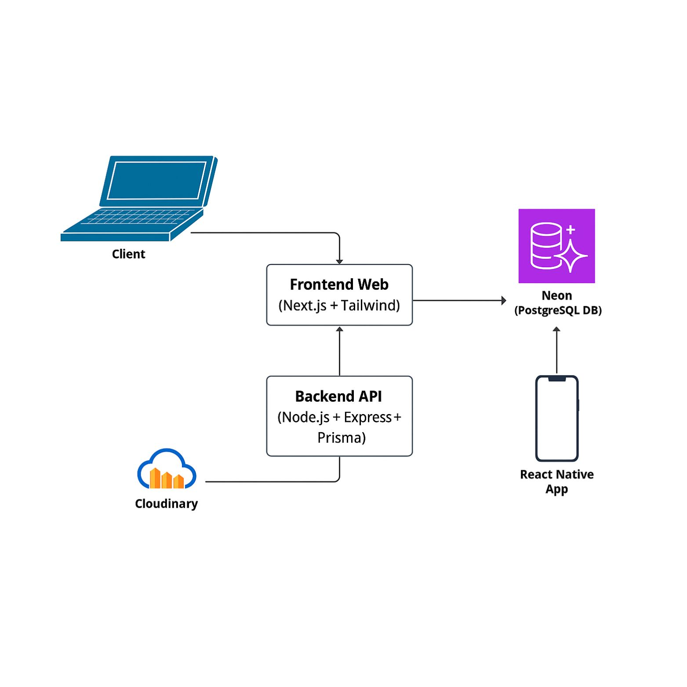

# 📱 Sweetland - server

> 📌 This app is part of a full system integrated with a [web version](https://github.com/grc-softdev/sweetland-client/tree/main) for management.


## Getting Started

To run the project locally:

```bash
npm install  
npm run dev
```

## Environment Variables

Use the `.env.example` as reference to create your configuration file `.env`.

```bash
DATABASE_URL=
JWT_SECRET=
PORT=
CLOUDINARY_NAME=
CLOUDINARY_KEY=
CLOUDINARY_SECRET=
```

# Backend

This project uses **Prisma ORM** with **PostgreSQL** to manage the backend and database. 

**Prisma Model**  	            | **Data Flow**
:------------------------------:|:------------------------------:
 | 


